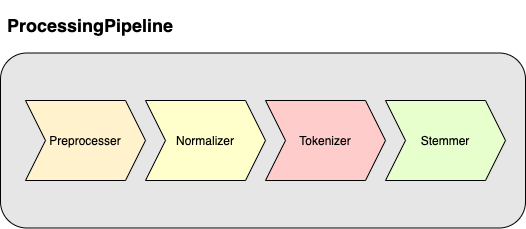
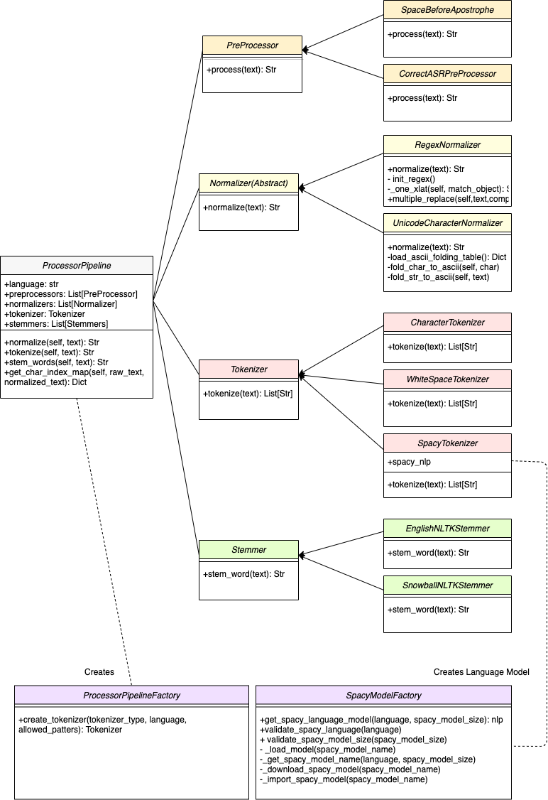

# PipelineProcessor (Tokenization) Design Doc

(Note: This README contains images. It is recommended to view the rendered md file.)

**Motivation:** Create a configurable end-to-end text processing pipeline to support multiple languages. 

**Summary:** The PipelineProcessor would contain a tokenizer, stemmer, and multiple prepocessors and normalizers which can be specified in the config. This redesign adopts a more object-oriented approach to text processing and follows a pipeline paradigm that is commonly used across popular NLP libraries (Spacy, HuggingFace, Stanza, etc.). One of the available Tokenizers includes a “SpacyTokenizer” which automatically downloads and uses the appropriate Spacy language model based on the language of the MindMeld application. The design is extensible as it allows developers to easily create and use custom Preprocessors, Normalizers, Tokenizers and Stemmers based on their language-specific requirements. The PipelineProcessor will be used when the QueryFactory creates a query object.

**Key Benefits:**

1. Multiple Language Support 
2. Configurability
3. Extensibility
4. Maintainability
5. More Intuitive Use for Developers

## Current Design:


In the current implementation, multiple responsibilities are tightly coupled into a single class (Character Normalization, Sentence Normalization, Tokenization). Moreover, “ASCII Folding” normalization is conducted by default. This maps various character representations, especially those with diacritical marks, to an ASCII equivalent, if it exists. This may not always be desirable, for example:

```text

Accents in Spanish: “quién sabe por qué pasó” becomes “quien sabe por que paso”

Umlaut (Ä ) in German: “zuverlässig” becomes “zuverlassig”

Eszett (ß) in German: “der weiß"” becomes “der weiss”

```

While these normalizations may not make a dramatic difference in classification accuracy, making ASCII Folding configurable may be helpful for non-english languages.

Note: Allowing for special characters may cause errors with Duckling. This is something to look into.

Current tokenization is limited to splitting by Whitespace characters, however, this is not ideal for languages such as German and Japanese as many words/ideas are often grouped together without a space. Alternative tokenization strategies are needed.

## Proposed Design:





### ProcessingPipline:

This class should be a singleton throughout a MindMeld Application. This class would be used in QueryFactory when creating a query. It would contain:

1. Preprocessors (Many, applies chained in config order)
2. Normalizers (Many, applies chained in config order)
3. Tokenizers (One)
4. Stemmer (One)

The Processing Pipeline can be customized with a config such as the one below. (Note: Need to consider passing in params for individual classes. Also, “allowed\_patterns” implementation.)

```python

PROCESSING_PIPELINE_CONFIG = {

    “preprocessors”: [

        “SpaceBeforeApostrophe”,

        “CorrectASRPreProcessor”

    ],

    “normalizers”: [

        “RegexNormalizer”,

        “ASCIIFoldingNormalizer”,

    ],

    “tokenizer”: “SpacyTokenizer”,

    “stemmer”: “EnglishNLTKStemmer”

}

```

### ProcessingPipelineFactory:

Used to create a ProcessingPipeline based on config values. It can also handle recommended defaults based on the language. For example, if the language is Japanese, then it will select “SpacyTokenizer”, skip “ASCIIFolding”, and use the “SnowballNLTKStemmer”.

### Preprocessor:

Some applications can benefit from modifying text before it goes through the rest of the pipeline. Example use cases include fixing ASR mistranscriptions or adding a space before apostrophes (French). The preprocessor class exists in MindMeld. The main change here is integrating it in a pipeline.

### Tokenizer:

Developers can choose from the following:

1. WhiteSpaceTokenizer – Splits on spaces.
2. CharacterTokenizer – Splits on characters.
3. SpacyTokenizer – Uses Spacy Language models for tokenization.

### Stemmer:

There aren’t any new changes to the existing stemmers. The only difference is that it is being exposed as a configurable option in this pipeline.

### Normalization:

This proposal decouples Normalization from the current Tokenizer class. There are two ways we can implement this:

Option 1: Keep current Regex rules and implementation in the same class (RegexNormalizer). We take “allowed\_patterns” in from the config as before.

Option 2: Split up normalization steps into individual classes. This would mean that any normalization step is either a replace or remove action. For example:

```text

“RemoveTrailingSpace”, “RemoveExclamation”, “RemoveDecimalsInWord”

```

The advantage here is that this is fully customizable and the normalization steps are transparent to the developer. The disadvantage would be that this list could get quite long. To add custom normalization here, the user can either remove the default normalizers or add a RemoveCustomNormalizer class instead of using the “allowed\_patterns” param. 


This is similar to what HuggingFace does:

```python
from tokenizers import normalizers

from tokenizers.normalizers import Lowercase, NFD, StripAccents

bert_tokenizer.normalizer = normalizers.Sequence([NFD(), Lowercase(), StripAccents()]
```

### "text\_processing” Module:

Files related to text preprocessing can be moved into their own module within MindMeld.

```text
text_processing
|
|---- __init__.py
|---- normalizers.py
|---- preprocessor.py
|---- processing_pipeline.py
|---- spacy_model_factory.py
|---- stemmers.py
|---- tokenizers.py
```

### Final Thoughts:

This approach can be broken into two separate PRs. In the first PR, we would only replace the “tokenize_raw” function with a configurable Tokenizer (Space, Character, or Spacy) and add this to the current config. This is comparatively simple and would take less time to implement. In the second PR, we can opt for the ProcessorPipeline approach.

